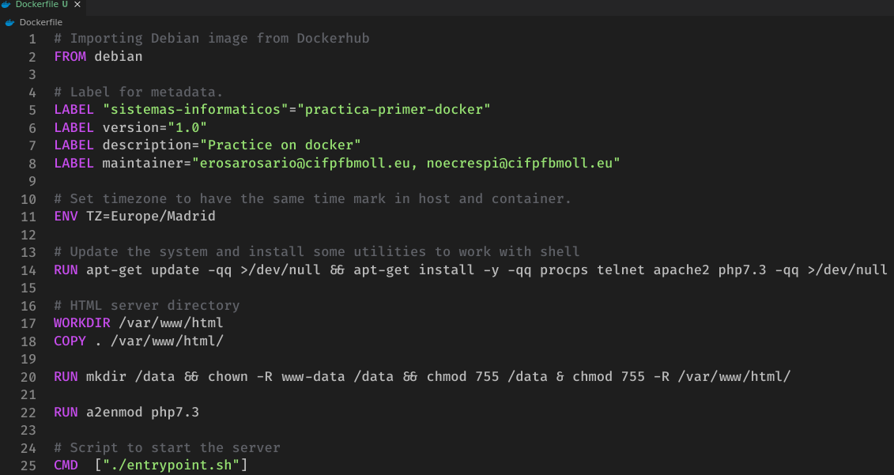
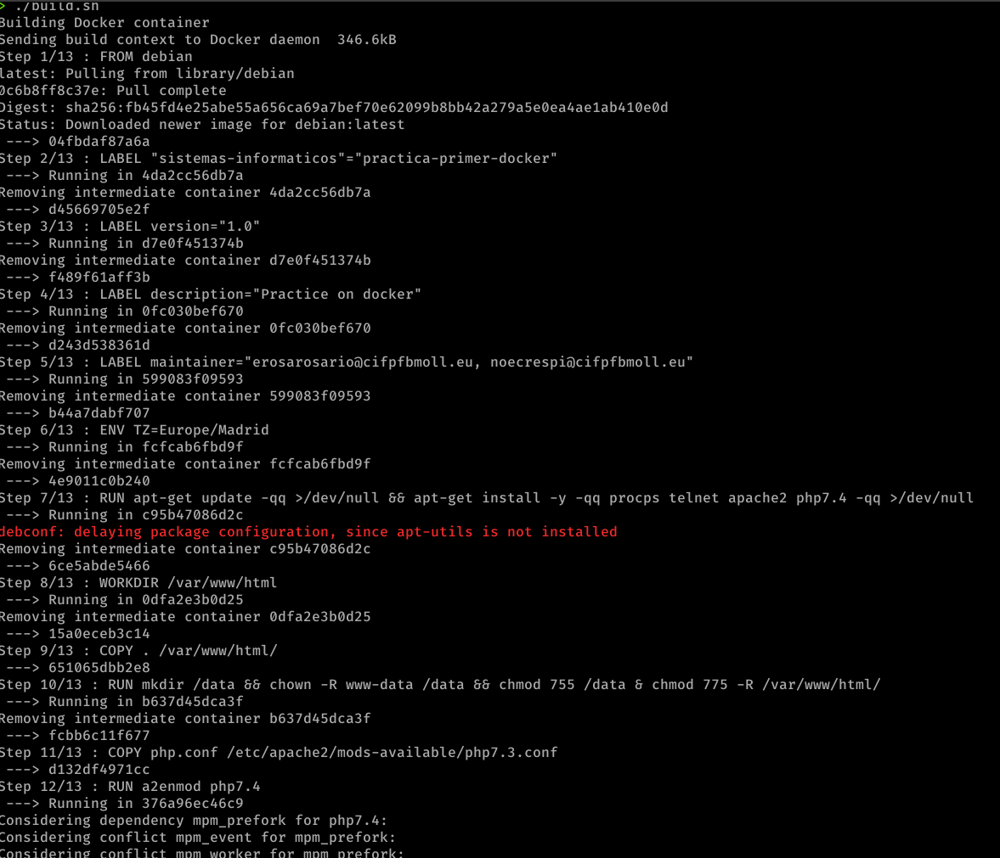
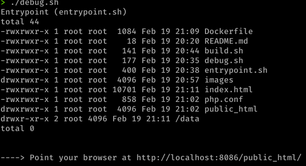
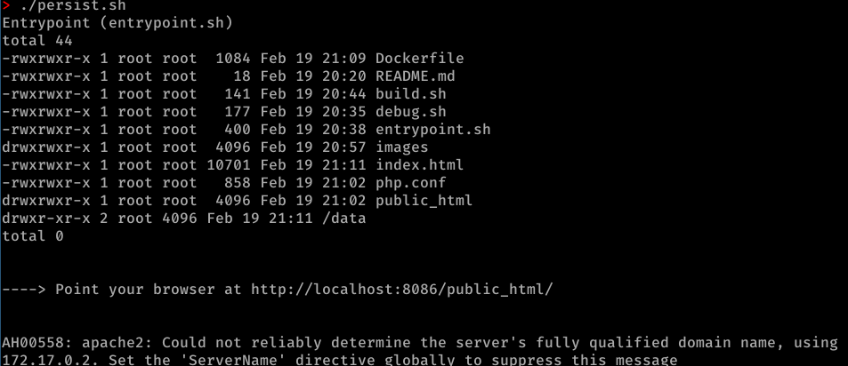

# docker-ker-koker

## ¿Qué es Docker?
Docker es una plataforma de software que le permite crear, probar e implementar aplicaciones rápidamente. Docker empaqueta software en unidades estandarizadas llamadas contenedores que incluyen todo lo necesario para que el software se ejecute, incluidas bibliotecas, herramientas de sistema, código y tiempo de ejecución. Con Docker, puede implementar y ajustar la escala de aplicaciones rápidamente en cualquier entorno con la certeza de saber que su código se ejecutará.

## ¿En que consiste la creación de un contenedor de Docker?
---
A partir de un fichero **Dockerfile**, lanzaremos un contenedor donde de ejecutará un servidor web **Apache** con el módulo **php** instalado. Y le indicaremos que copie todos los ficheros de nuestro directorio actual, al directorio por defecto de apache. En nuestro directorio real donde tendremos diversos scripts, los cuales nos permitirán probar algunas de las opciones de **Docker**.

## ¿Cómo crar mi primer contenedor en Docker? 
---

1. Descargar los docuemntos necesarios(se encuentran en classroom).

2. Preparar el directorio donde copieramos los rchivos locales al contenedor.

###### Directorio de los archivos locales del contenedor

### Contenido de `Dockerfile`:

1. Ejecutar:
    El Dockerfile hereda de la imagen de Debian en Docker Hub.

`# we will inherit from  the Debian image on DockerHub`

    ```FROM debian```

2. Configurar la zona horaria del contenedor para que coincida con la zona horria del host.
`# set timezone so files' timestamps are correct`
    
    ```ENV TZ=Europe/Madrid```

 3. Instalar Apache y PHP 7.3 que se instala en el sistema de archivos del contenedor y no en el sistema de archivos del host, además de isntalar unas utilidaddes de comandos que permiten examinar el estado del contenedor.
    
    `# install apache and php 7.3`

    `# we include procps and telnet so you can use these with shell.sh propt`

    ```RUN apt-get update -qq >/dev/null && apt-get install -y -qq procps telet apache2 php7.3 -qq >/dev/null```

4. Poner los scripts PHP en `/var/www/html`.

`# HTML server directory`

    ```
    WORKDIR /var/www/html
    COPY . /var/www/html/
    ```

5. Crear archivo de configuración PHP.

`# The PHP app is going to save its state in /data so we make a /data insde the container`

    ```RUN mkdir /data && chown -R www-data /data && chmod 755 /data & chmod 755-R /var/www/html/```

6. Necesitar un archivo de configuración php personalizado para habilitar los directorios de usuario.

`# we need custom php configuration file to enable userdirs`

    ```COPY php.conf /etc/apache2/mods-available/php7.3.conf```

7. Habilitar directorio de usuario y php.

`# enable userdir and php`

    ```RUN a2enmod php7.3```

8. Ejecutar script para iniciar el servidor.

    `# we run a script to stat the server; the array syntax makes it so ^C wil work as we want`

    ```CMD  ["./entrypoint.sh"]```



###### dockerfile

3. Despúes de configurar el `Dockerfile`  hay que construir el contenedor (`build.sh`). 

```
#!/bin/sh

# build.sh

# we use the "docker build" command to build a container named "chapter2" from . (current directory)
# Dockerfile is found in the current directory, and determines how the conatiner is built.

docker build -t chapter2 .
```

###### buildshexecute

###### buildshcode

4. Lanzar el contenedor (`debug.sh`).

```
#!/usr/bin/env bash

# debug.sh

# run container without making it a daemon - useful to see logging output

docker run \
    --rm \
    -p8086:80 \
    --name="chapter2" \
    -v ${pwd}:/home/app \
    chapter2
```


###### debugshexecute

###### debugshcode

###### containerrunning

5. Acceder al servidor PhP hosteado con el contenedor de Docker.


###### counterdebug

###### persistexecute

###### persistestado

###### stopestado


##  Bibliografía

- [amazon](https://aws.amazon.com/es/docker//)
- [javiergarzas](https://www.javiergarzas.com/2015/07/que-es-docker-sencillo.html)
- [github/maximofernandezriera](https://github.com/maximofernandezriera/practica-primer-docker/blob/main/README.md)
